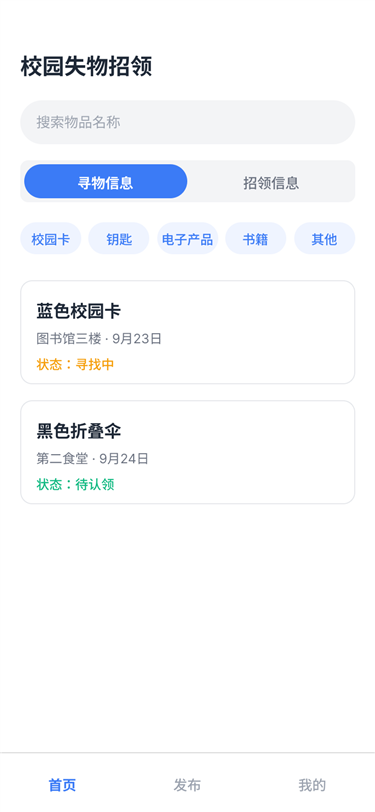
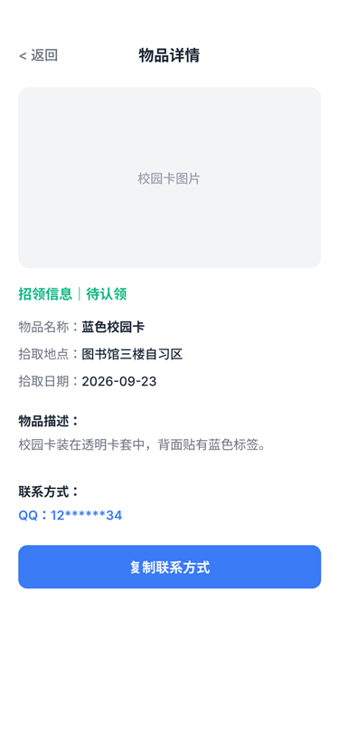
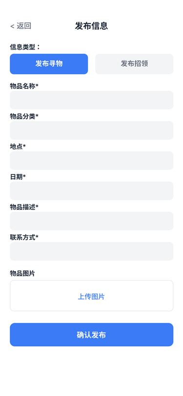
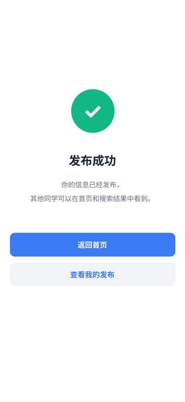
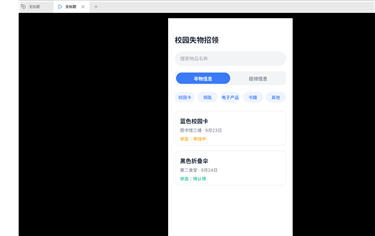
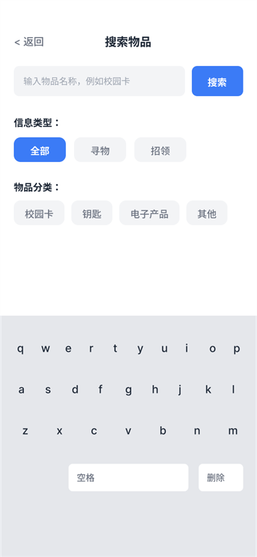

# 2026秋软件工程第一次结对作业——校园失物招领小程序需求分析与原型设计

## 一、成员信息

| 学号 | 姓名 | 本次分工 |
|---|---|---|
| 102401434 | 包学丰 | 需求分析、流程图、博客初稿 |
| 102401436 | 冯玄 | Figma 原型、页面交互、原型截图 |

## 二、项目背景

校园里丢东西、捡东西每天都在发生，但信息渠道分散：班级群、年级群、宿舍群各说各的，一条失物消息几分钟就被刷走，需要看到的人往往看不到；捡到东西的同学也不知道该交给谁、去哪发布。结果是"有人丢、有人捡，两边对不上"，找回全靠运气。我们希望做一个只服务校园的失物招领小程序，把两类信息集中到一个入口，按分类、地点、时间组织并带上明确状态，让失主能快速搜到、拾主能低成本发布。

## 三、用户与需求分析

主要用户是两类在校学生。**丢失物品的学生**：刚丢东西时最着急，需要尽快找到与自己物品匹配的招领信息，因此要能按名称、分类、时间地点筛选，并一眼看到联系方式；也希望自己发布的信息状态可更新，找回后能标记结束。**捡到物品的学生**：捡到并非他的责任，也没时间写长描述，因此要用最少的填写量把信息挂出去——字段少、提示明确、图片可选。两类用户共同的核心需求是：信息可信（有名称、地点、日期、描述）、联系方便、状态明确（寻找中／待认领／已找回）。详细需求见：[需求分析](requirements.md)。

## 四、主要功能

1. 浏览寻物和招领信息；
2. 发布寻物信息；
3. 发布招领信息；
4. 搜索物品；
5. 查看物品详情与联系方式；
6. 修改信息状态。

## 五、原型设计

- 使用工具：**Figma**（桌面版；画布尺寸 375×812 手机尺寸，设计过程通过 Figma MCP 接口程序化写入文件）
- 在线链接：`【待补：Figma 分享链接】`

设计思路：**一屏一 Frame 横向排列**，七个主页面（首页、搜索页、搜索结果页、信息详情页、发布信息页、发布成功页、我的发布页）加两个补充详情页，共九屏。首页自上而下是标题、搜索框、寻物／招领切换、五个分类入口、信息卡片列表和底部导航，把"看"和"找"都放在第一屏。发布页用**竖排表单**，六项必填加一项可选图片，字段顺序与用户心里填写的顺序一致，底部固定"确认发布"。详情页用图片占位块加字段列表，联系方式单独成行并配"复制联系方式"按钮，让"联系发布者"成为最显眼的动作。**状态用颜色区分**：寻找中橙色、待认领绿色。交互上共写入 245 条原型反应，分类 chip 用**状态副本帧 + Smart animate** 实现原地高亮（Figma 原型不能在点击时改样式），搜索框支持逐字输入演示。

### 原型截图

<table>
<tr>
  <td align="center"> 首页</td>
  <td align="center"> 搜索页</td>
</tr>
<tr>
  <td align="center"> 搜索结果页</td>
  <td align="center"> 信息详情页</td>
</tr>
<tr>
  <td align="center"> 发布信息页</td>
  <td align="center"> 发布成功页</td>
</tr>
<tr>
  <td align="center"> 我的发布页</td>
  <td align="center">共 9 屏 此处展示 7 个主页面</td>
</tr>
</table>

## 六、用户使用流程

详细流程见：[用户流程](flow.md)。

<table>
<tr>
  <td align="center"> 浏览 → 查看详情</td>
  <td align="center"> 搜索物品</td>
</tr>
<tr>
  <td align="center"> 发布信息</td>
  <td align="center"> 修改信息状态</td>
</tr>
</table>

说明：从首页进入后分成两条主线。**找东西**：浏览信息卡片或点搜索框输入名称，进入搜索结果列表，点开卡片看详情，最后复制联系方式——三步内到达联系动作。**发东西**：从底部导航进发布页，选寻物／招领，填写名称、分类、地点、日期、描述和联系方式，点"确认发布"进入成功页，可返回首页或去"我的发布"管理并把状态改为"已找回／已归还"。

## 七、结对过程

两人对照需求文档逐条确定九个页面、字段与状态，随后按各自职责分工：包学丰负责需求分析与流程图，冯玄负责 Figma 原型与页面交互；完成后交换检查，逐屏核对文案、颜色与跳转，并在演示模式下验证每条连线是否到达正确页面。过程中发现并修正三类问题：返回按钮缺少连线、第二张卡片没有对应详情页、分类筛选点击后没有反馈。

<table>
<tr>
  <td align="center"> 原型在演示模式下跑通</td>
  <td align="center"> 输入演示帧</td>
</tr>
</table>

配对过程记录见：[提交历史](https://github.com/tw1l1ghtcc/campus-lost-found/commits/main)。

## 八、PSP表格

见：[PSP表格](psp.md)。

## 九、个人总结

- [包学丰个人总结](../summaries/34.md)
- [冯玄个人总结](../summaries/36.md)
