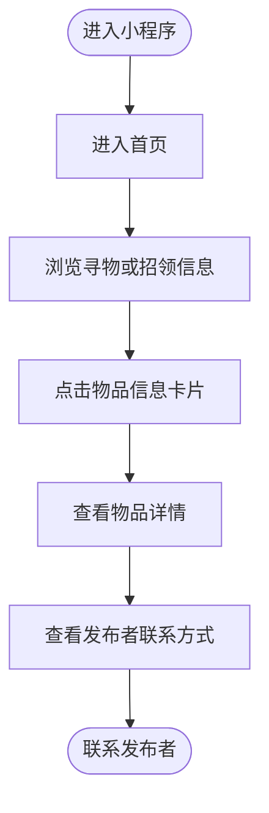
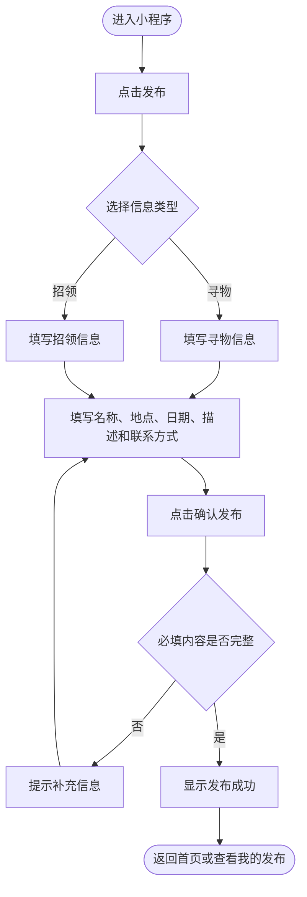
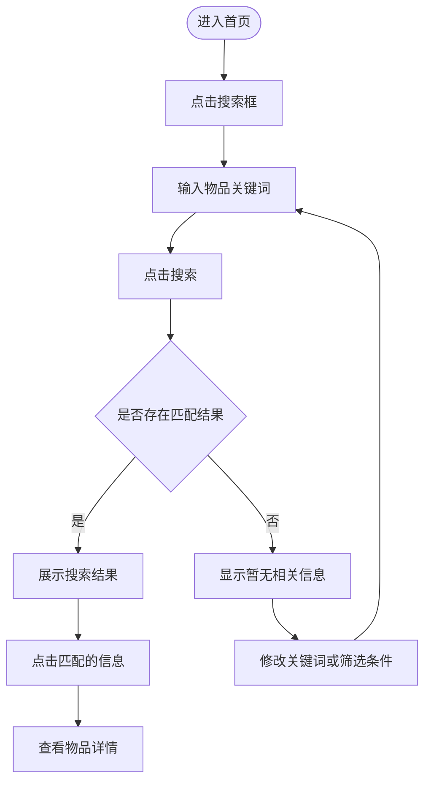
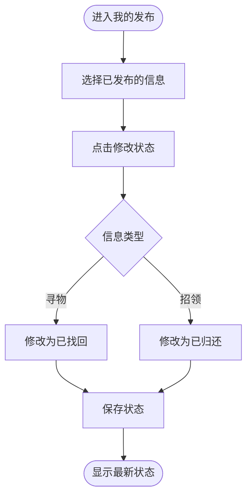

# 用户使用流程

## 1. 浏览信息并查看详情

```mermaid
flowchart TD
    A([进入小程序]) --> B[进入首页]
    B --> C[浏览寻物或招领信息]
    C --> D[点击物品信息卡片]
    D --> E[查看物品详情]
    E --> F[查看发布者联系方式]
    F --> G([联系发布者])
```

## 2. 发布信息

```mermaid
flowchart TD
    A([进入小程序]) --> B[点击发布]
    B --> C{选择信息类型}
    C -->|寻物| D[填写寻物信息]
    C -->|招领| E[填写招领信息]
    D --> F[填写名称、地点、日期、描述和联系方式]
    E --> F
    F --> G[点击确认发布]
    G --> H{必填内容是否完整}
    H -->|否| I[提示补充信息]
    I --> F
    H -->|是| J[显示发布成功]
    J --> K([返回首页或查看我的发布])
```

## 3. 搜索物品

```mermaid
flowchart TD
    A([进入首页]) --> B[点击搜索框]
    B --> C[输入物品关键词]
    C --> D[点击搜索]
    D --> E{是否存在匹配结果}
    E -->|是| F[展示搜索结果]
    F --> G[点击匹配的信息]
    G --> H[查看物品详情]
    E -->|否| I[显示暂无相关信息]
    I --> J[修改关键词或筛选条件]
    J --> C
```

## 4. 修改信息状态

```mermaid
flowchart TD
    A([进入我的发布]) --> B[选择已发布的信息]
    B --> C[点击修改状态]
    C --> D{信息类型}
    D -->|寻物| E[修改为已找回]
    D -->|招领| F[修改为已归还]
    E --> G[保存状态]
    F --> G
    G --> H([显示最新状态])
```