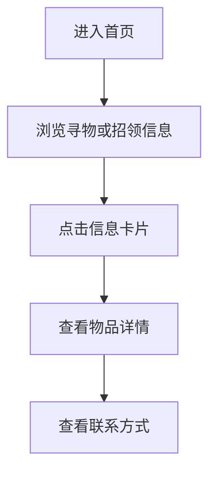
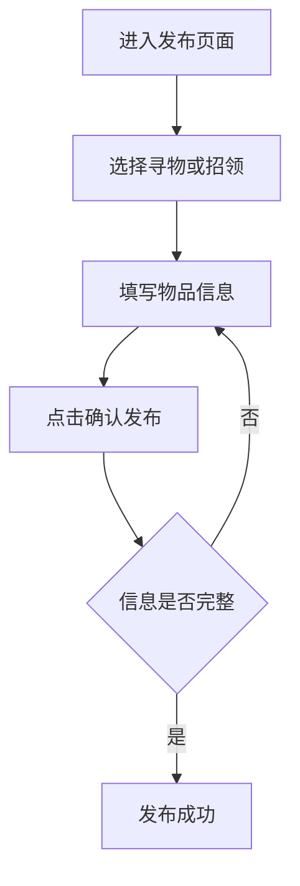
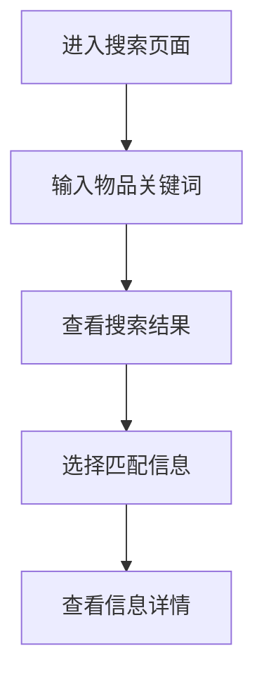
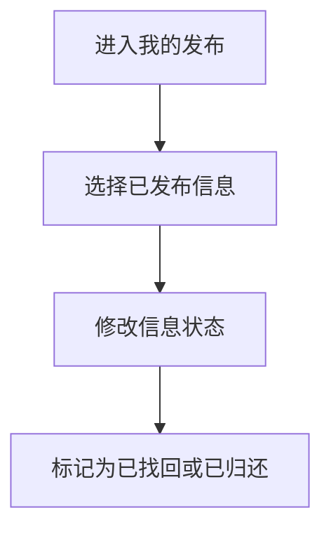

# 用户使用流程

## 1. 浏览并查看详情

```mermaid
flowchart TD
    A[进入首页] --> B[浏览寻物或招领信息]
    B --> C[点击信息卡片]
    C --> D[查看物品详情]
    D --> E[查看联系方式]
```

## 2. 发布信息

```mermaid
flowchart TD
    A[进入发布页面] --> B[选择寻物或招领]
    B --> C[填写物品信息]
    C --> D[点击确认发布]
    D --> E{信息是否完整}
    E -->|否| C
    E -->|是| F[发布成功]
```

## 3. 搜索物品

```mermaid
flowchart TD
    A[进入搜索页面] --> B[输入物品关键词]
    B --> C[查看搜索结果]
    C --> D[选择匹配信息]
    D --> E[查看信息详情]
```

## 4. 修改信息状态

```mermaid
flowchart TD
    A[进入我的发布] --> B[选择已发布信息]
    B --> C[修改信息状态]
    C --> D[标记为已找回或已归还]
```

流程图导出为图片后，请放入 `assets/flowcharts/`。

